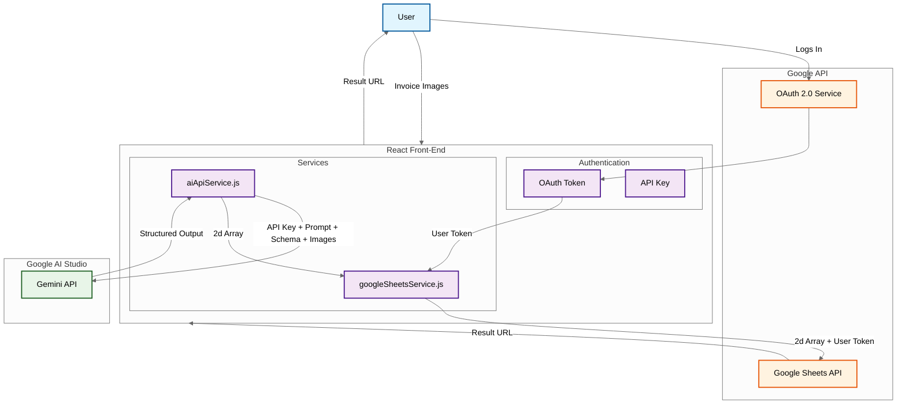

# remi2AI: AI-Powered Invoice Automation

remi2AI is a simple web application that helps automate data entry by transcribing paper invoices into a spreadsheet format. It uses Google's Gemini AI to extract data from scanned images and the Google Sheets API to populate a new, formatted spreadsheet, saving significant manual effort.

# Live Demo

Try it for yourself at: [9600bauds.github.io/remi2AI](https://9600bauds.github.io/remi2AI/) (if you need a suitable invoice image, save [this example](/public/demo_image.jpg) to your device!)

# Demonstration video

https://github.com/user-attachments/assets/a53b35be-86f2-4e68-aebc-3c43c8bf644c

# Problem Statement & Solution Overview

Digitizing paper invoices was a time-intensive process in my workplace, and attempts at automating it proved elusive for many years due to the simple fact that the invoices received lacked any sort of standard for formatting and layout.  
Standard OCR techniques couldn't deal with the massive variety present in the invoices, or with the fact that printing and scanning imperfections sometimes made them hard to read, even for a human.

Multimodal AI proved to be a surprisingly reliable and general solution to this task: Its image recognition rivals the best OCR out there, and it can make on-the-fly assumptions on how the invoice is formatted, even for new layouts that the program has never seen before.  
Using prompt engineering and a structured output, it's possible to automatically extract only the relevant data from a scanned invoice, which can then be exported into a spreadsheet.

I created a simple web UI where the user may upload a scanned image and click "Process". No further user input is needed as the API calls are made to Google AI Studio, and the structured output is then converted and sent to the Google Sheets API. The spreadsheet is then automatically opened in a new tab.

# Key Features
 - User-friendly file upload, leveraging `react-dropzone` to allow for drag-and-drop functionality and image previews.
 - AI-powered data extraction using Google AI Studio: It has a rich API which allows for detailed prompts, thinking tokens, and a well-defined structured output. The result is a surprisingly reliable JSON digitization of the data requested in the schema.
 - Automated creation of a new Google Sheet: The Google Cloud API is similarly rich and allows you to create new spreadsheets inside the end user's Google Drive.
 - Secure Google Sign-In (OAuth 2.0 via `@react-oauth/google`): OAuth allows each user to sign into their Google account, making sure all processed data is secure, and the created sheet is owned by the end user.
 - Data population into the newly created Google Sheet: Google Sheets API allows for a template to be applied, and the structured data to be uploaded to a predefined range.
 - Multi-language support (English/Spanish) using `i18next`.
 - Responsive user interface built with Bootstrap.

# Technologies Used
 - Frontend: React, Vite, TypeScript, Bootstrap 5, CSS Modules.
 - Internationalization: i18next, react-i18next.
 - File Handling: react-dropzone.
 - APIs & Services:
    - Google Gemini API (via @google/genai SDK).
    - Google Sheets API & Google Drive API (via gapi.client).
 - Authentication: OAuth 2.0 (via @react-oauth/google, gapi.client).
 - State Management: React Hooks (useState, useEffect, useRef).
 - Deployment: GitHub Pages.
 - Development Tools: ESLint, Prettier.

## System Architecture
The system is a pure front-end which stores the current state inside a React component.  
Due to the generous Google APIs and the customization they allow via the Google Cloud Project console, a dedicated back-end was considered unnecessary.  

The only downside of a pure front-end is that it is incapable of securely storing an API key without exposing it to the user.  
This was considered an acceptable limitation, as the API key is relatively unimportant in this case: The Google Cloud console can already restrict usage of the key appropriately, and a free API key can be used with no budget allocated, since  even purely free Gemini Vision models work well for this task. For the live demo, I've provided a free key with appropriate limitations.  

In the future, more features such as user settings (prompt/schema configuration etc) can also be implemented without the need for a back-end via the `auth/drive.appdata` scope in the already implemented google API.  




## Setup and Run Locally

Follow these instructions to get a local copy of remi2AI up and running on your machine for development and testing purposes.

### 1. Clone the Repository

First, clone the repository to your local machine:
```bash
git clone https://github.com/9600bauds/remi2AI.git
cd remi2AI
```

### 2. Install Dependencies

Navigate to the project directory and install the necessary dependencies:
```bash
npm install
```

### 3. Set Up Environment Variables

1.  Create a file named `.env` in the root of your project.
2.  Open the `.env` file and add the following variables, replacing the placeholder values with your actual credentials:

    ```env
    VITE_GOOGLE_CLIENT_ID="YOUR_GOOGLE_OAUTH_CLIENT_ID"
    VITE_GOOGLE_API_KEY="YOUR_GOOGLE_CLOUD_PROJECT_API_KEY"
    ```

    **To get these values:**  
        1.  Go to the [Google Cloud Console](https://console.cloud.google.com/).  
        2.  Create a new project or select an existing one.  
        3.  Create a new API key. Enable **Google Sheets API**, **Google Drive API** and **Generative Language API**. Restrict the API key to only be usable by these APIs.  
        4.  Copy this key and use it as the value for `VITE_GOOGLE_API_KEY`.  
        5.  Go to "Credentials" -> "Create Credentials" -> "OAuth client ID".  
        6.  Choose "Web application" as the application type.  
        7.  Under "Authorized JavaScript origins", add your development URL (e.g., `http://localhost:5173` - check your Vite dev server port) and your planned deployment URL.  
        8.  Under "Authorized redirect URIs", add the same URLs.  
        9.  Copy the generated **Client ID** and paste it as the value for `VITE_GOOGLE_CLIENT_ID`.  


### 4. Start the Development Server

Once dependencies are installed and environment variables are set, you can start the Vite development server:
```bash
npm run dev
```

This will typically start the application on `http://localhost:5173` (or another port if 5173 is in use). Open this URL in your web browser to see the application running.
